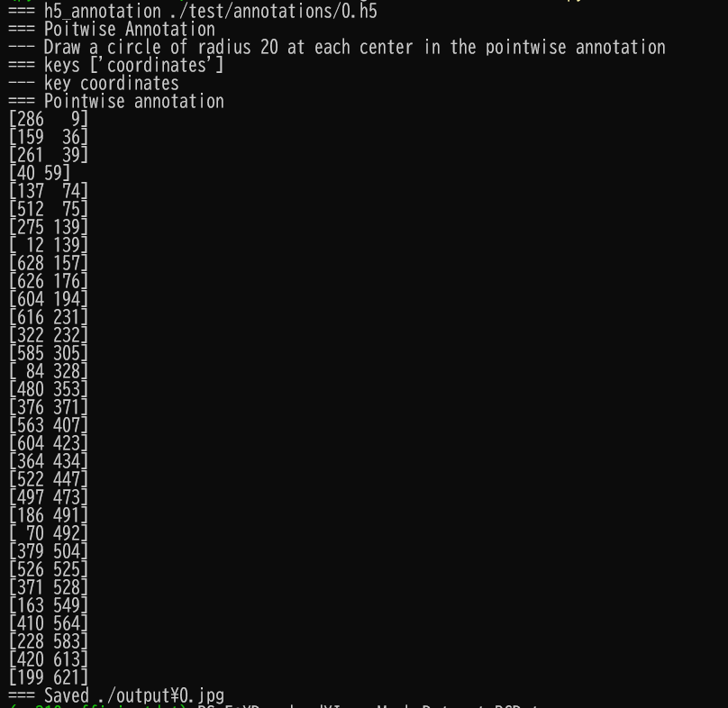
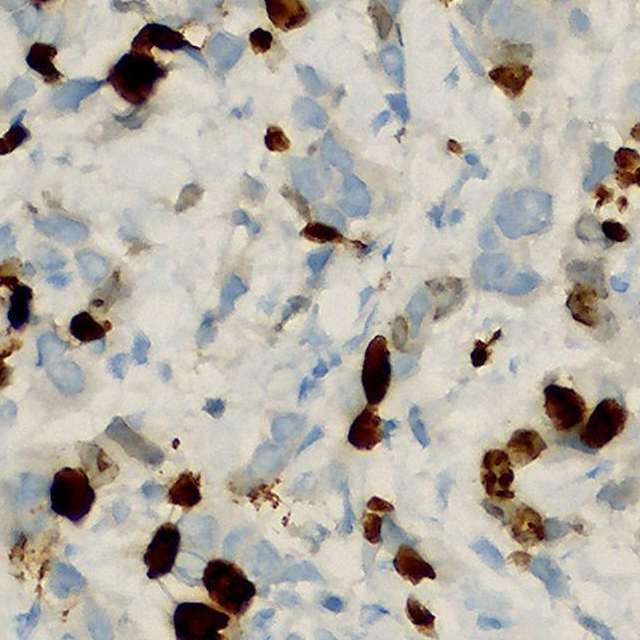
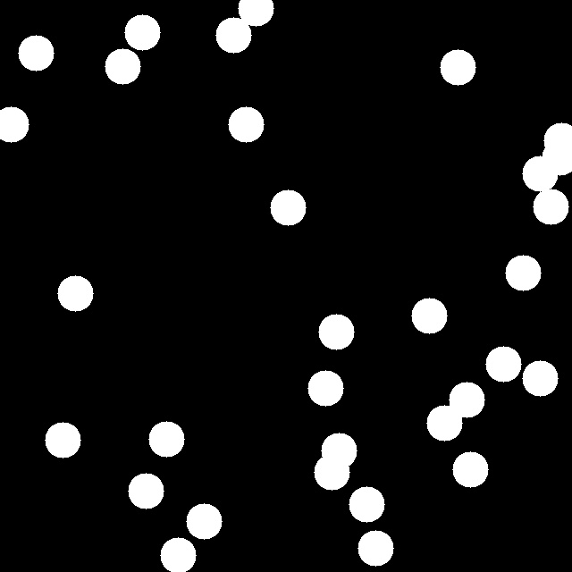

<h2>ImageMask-Dataset-BCData  (2024/07/03)</h2>

This is ImageMask Dataset for BCData: A Large-Scale Dataset and Benchmark for Cell Detection and Counting
(MICCAI 2020).
 
The original dataset used here has been taken from the following web-site 
<b>BCData: A Large-Scale Dataset and Benchmark for Cell Detection and Counting </b> 
<pre>
https://sites.google.com/view/bcdataset
</pre>
The BCData can be downloaded from the google drive 
<a href="https://drive.google.com/file/d/16W04QOR1E-G3ifc4061Be4eGpjRYDlkA/view?usp=sharing">BCData.zip</a>.

<b>Download ImageMask-Dataset</b> 
You can download the BCData ImageMask-Dataset, derived by us from the original BCData, from the google drive 
<a href="https://drive.google.com/file/d/1J62EHi0JLDfL-lVPkN_W7KXaeOEVOrWC/view?usp=sharing">
BCData-ImageMask-Dataset-V1.zip</a>
 

<h3>1. Dataset Citation</h3>

<a href="https://link.springer.com/chapter/10.1007/978-3-030-59722-1_28">
BCData: A Large-Scale Dataset and Benchmark for Cell Detection and Counting</a> 
Medical Image Computing and Computer Assisted Intervention – MICCAI 2020, 2020, Volume 12265 
ISBN : 978-3-030-59721-4 

Zhongyi Huang, Yao Ding, Guoli Song, Lin Wang, Ruizhe Geng, Hongliang He, Shan Du, Xia Liu,  
Yonghong Tian, Yongsheng Liang, S. Kevin Zhou & Jie Chen 

<h3>2. Download BCData</h3>

If you would like to create BCData ImageMask Dataset by yourself,
please download the set from the google drive 
<a href="https://drive.google.com/file/d/16W04QOR1E-G3ifc4061Be4eGpjRYDlkA/view?usp=sharing">BCData.zip</a>.
 

<h3>3. H5AnnotationParser</h3>
To parse an h5 annotation file, please run the following command for Python 
script <a href="./H5AnnotationParser.py">H5AnnotationParser.py</a>.
 
<pre>
> python H5AnnotatonParser.py
</pre>
<b>Console output</b>:  
As shown below, an h5 annotation file of BCData contains the point coordinates correspoding to the cells. 
 
 
The command will generate a Circled pointwise mask file as shown below. 
<table>
<tr>
<th>
Image
</th>
<th>
Circled pointwise mask
</th>

</tr>
<tr>
<td>

</td>
<td>

</td>
</tr>
</table>

 
 
<h3>4. ImageMaskDataset Generation</h3>

Please run the following command for Python script <a href="./ImageMaskDatasetGenerator.py">ImageMaskDatasetGenerator.py</a>.
 
<pre>
> python ImageMaskDatasetGenerator.py
</pre>
This command will generate 640x640 JPG image mask dataset. 
<pre>
./BCData-ImageMask-Dataset-V1
├─test
│  ├─images
│  └─masks
├─train
│  ├─images
│  └─masks
└─validation
    ├─images
    └─masks
</pre>

Train images sample 
  
Train mask sample 
  

Dataset Statistics  
 
